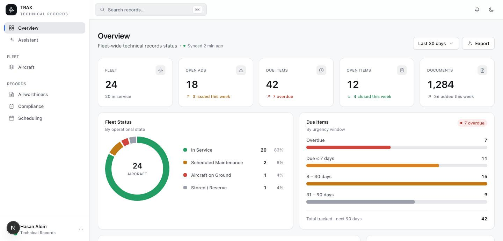
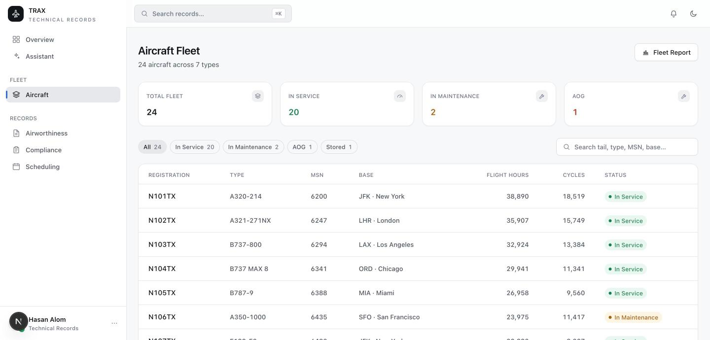
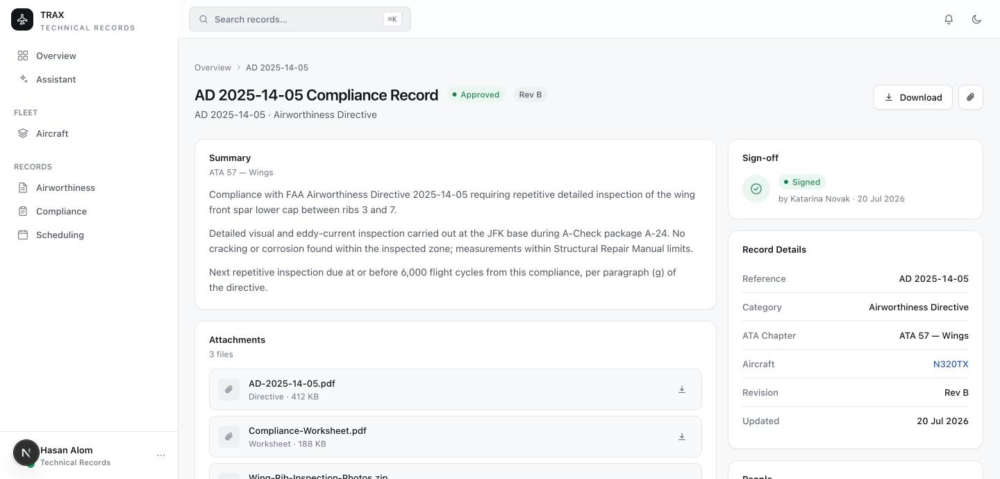
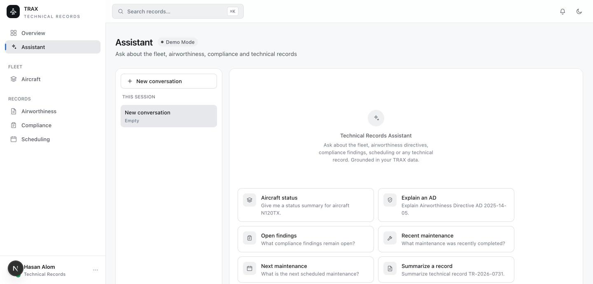
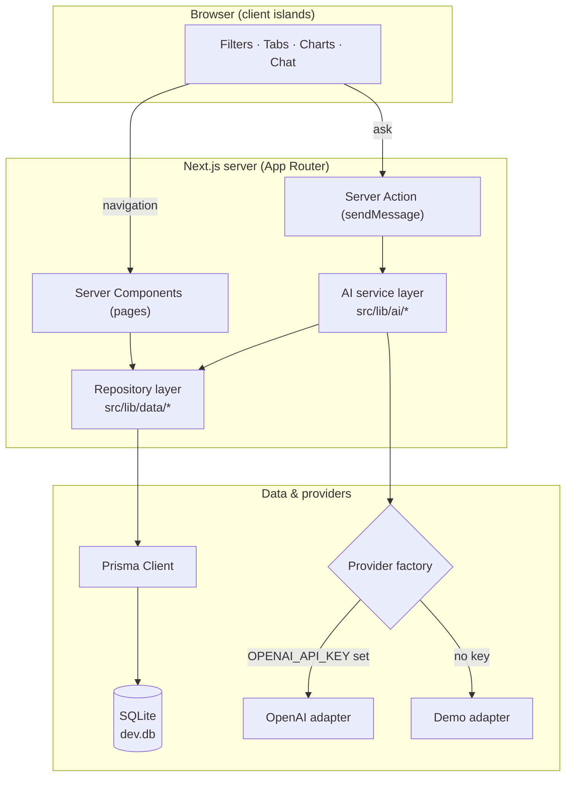
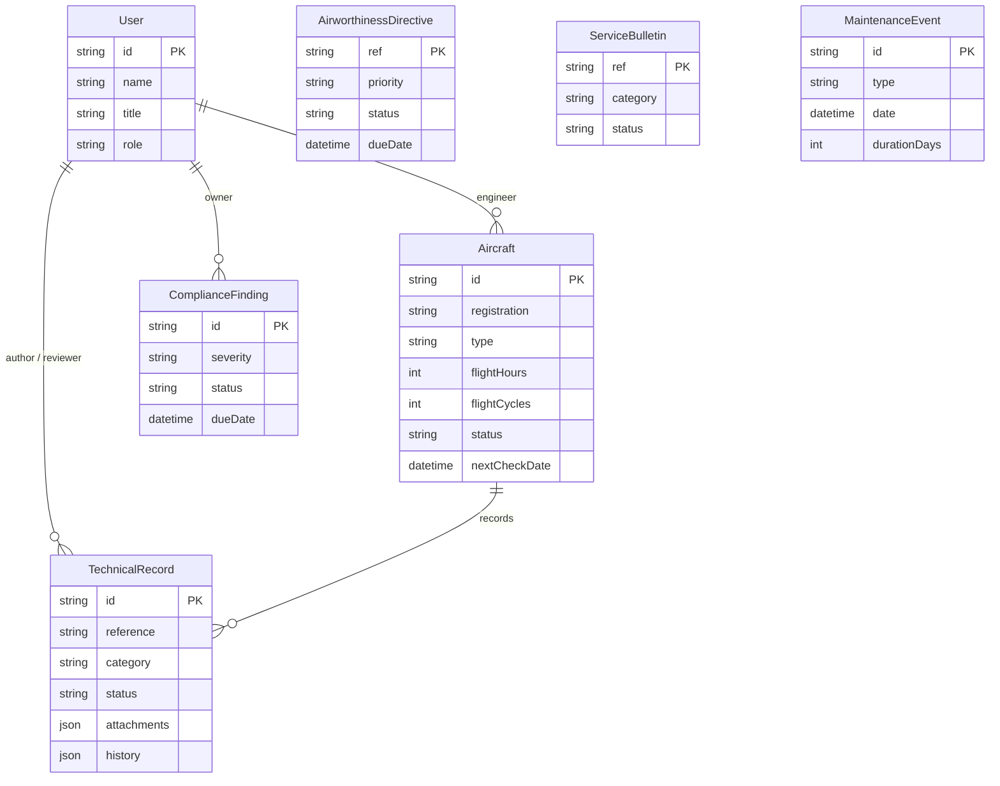

<div align="center">

# ✈️ TRAX — Aviation Technical Records

**An interview-quality Aviation Technical Records dashboard** — fleet management, airworthiness directives, compliance findings, maintenance scheduling, and an AI records assistant.

Built with Next.js 16 (App Router), React 19, TypeScript, Tailwind CSS v4, Prisma + SQLite, and the OpenAI SDK.


</div>

---

## Overview

TRAX is a portfolio project that looks and behaves like software used inside a major airline's technical-records department. It is intentionally **read-only** and runs entirely on local, seeded demo data — no external services are required to run it.

The project was built in six deliberate phases: a design-token **foundation**, an enterprise **dashboard**, the technical-records **modules**, a **Prisma/SQLite backend**, an **AI assistant**, and a final **production-polish** pass.

> **Design language:** minimal, enterprise, handcrafted — inspired by Apple, Microsoft Fluent 2, Vercel, Linear and Raycast. Restrained use of color, a single accent, dense-but-legible typography, and full light/dark theming.

## Screenshots

| Overview | Aircraft Fleet |
| --- | --- |
|  |  |

| Technical Record Detail | AI Assistant |
| --- | --- |
|  |  |

## Features

- **Overview dashboard** — KPI cards, a hand-built SVG fleet-status donut, a due-items chart, recent documents, activity feed and quick actions.
- **Aircraft fleet** — searchable, status-filterable register (24 aircraft) with tail number, type, MSN, hours, cycles, base and status; deep-links to per-aircraft detail.
- **Aircraft detail** — technical summary (hours/cycles/next check), maintenance history, current status, aircraft information and assigned engineer.
- **Airworthiness** — Airworthiness Directives (AD) and Service Bulletins (SB) in tabs, each with search, filters, priority, compliance state and due dates.
- **Compliance** — open / closed findings, a review queue, and an audit history timeline.
- **Scheduling** — a calendar-style month view of planned maintenance plus an upcoming timeline (A-checks, C-checks, engine inspections).
- **Technical record detail** — metadata, ATA chapter, author/reviewer, revision, sign-off, static attachments, change history and notes.
- **AI Technical Records Assistant** — a Copilot-style chat grounded in the repositories, with suggested prompts, deterministic **source references**, session-only conversation history, and a **Demo Mode** that works with no API key.
- **Production polish** — full light/dark theming, keyboard navigation with visible focus, accessible landmarks, loading / empty / error states, a branded 404, and per-route metadata.

## Architecture

The app is a single Next.js App Router project. Pages are **React Server Components** that fetch through a repository layer; small **client islands** handle interactivity (filtering, tabs, chat). The database and the AI SDK are **server-only** — nothing UI-side imports them.



**Key boundaries**

- Pages never call Prisma directly — only repository functions (`getAircraft`, `getTechnicalRecord`, …).
- The UI never calls the AI SDK — it calls a single Server Action, which calls the AI service layer.
- Provider selection lives in exactly one file (`src/lib/ai/provider.ts`); everything else depends only on the `AiProvider` interface, so OpenAI can be swapped for Azure by adding one adapter.

## Technology Stack

| Area | Choice |
| --- | --- |
| Framework | Next.js 16 (App Router, Turbopack, RSC + Server Actions) |
| UI | React 19, TypeScript 5 |
| Styling | Tailwind CSS v4 (CSS-first design tokens), Geist font |
| Database | Prisma 6 ORM + SQLite |
| AI | OpenAI SDK (provider-abstracted) with a local Demo provider |
| Tooling | ESLint (next/core-web-vitals), tsx (seed runner) |

## Folder Structure

```
trax/
├─ prisma/
│  ├─ schema.prisma        # 7 models (SQLite)
│  ├─ migrations/          # committed migration history
│  ├─ seed.ts              # idempotent seed runner
│  └─ seed-data.ts         # canonical demo dataset (single source)
├─ docs/screenshots/       # README images
└─ src/
   ├─ app/                 # routes (RSC pages, layouts, loading/error/not-found)
   │  ├─ page.tsx          # Overview dashboard
   │  ├─ aircraft/         # fleet list + [id] detail
   │  ├─ airworthiness/    # AD + SB
   │  ├─ compliance/       # findings, review queue, history
   │  ├─ scheduling/       # calendar + timeline
   │  ├─ records/[id]/     # technical record detail
   │  └─ assistant/        # AI assistant page + Server Action
   ├─ components/
   │  ├─ ui/               # design-system primitives (Card, Button, Table, …)
   │  ├─ layout/           # app shell, sidebar, topbar, nav
   │  ├─ dashboard/        # dashboard widgets
   │  ├─ fleet/ · airworthiness/ · compliance/ · scheduling/
   │  ├─ assistant/        # chat UI (client)
   │  └─ icons/            # in-house SVG icon set
   ├─ lib/
   │  ├─ data/             # repository layer (server-only Prisma queries)
   │  ├─ ai/               # AI service layer (types, provider, prompts, context)
   │  ├─ db.ts             # Prisma client singleton
   │  └─ format.ts, cn.ts, badges.ts, …
   └─ styles/              # design tokens, base layer, utilities
```

## Database Schema Overview

SQLite via Prisma. Dates are stored as `DateTime` and converted to display strings in the repository layer. Sub-documents on records (attachments, history, notes, sign-off) are stored as JSON.



`AirworthinessDirective`, `ServiceBulletin` and `MaintenanceEvent` are standalone; the Review Queue, Compliance History, Recent Activity and dashboard aggregates are intentionally kept as static presentation constants (they have no dedicated model).

## AI Assistant Architecture

The assistant is grounded strictly in the repository data (no RAG, no vector search, no external knowledge) and is fully read-only.

```
src/lib/ai/
├─ types.ts          # ChatMessage, AiResult, Source, AiProvider, AiError
├─ provider.ts       # getProvider() — the ONLY place provider selection lives
├─ providers/
│  ├─ openai.ts      # OpenAI adapter (only SDK-aware module)
│  └─ mock.ts        # Demo provider (deterministic, grounded, no network)
├─ prompts.ts        # small composable prompt builders (no monolithic prompt)
├─ context.ts        # relevance-limited retrieval + deterministic Sources
├─ assistant.ts      # public API (askAssistant, summarizeRecord, …)
└─ index.ts          # barrel (server-only)
```

- **Grounded, not generative-from-memory** — a lightweight router extracts referenced entities (tail numbers, AD/SB/record refs, finding ids) or intent, then fetches **only the relevant records** to keep tokens small.
- **Source references** are computed deterministically from what was retrieved and rendered under each answer (with deep-links to record and aircraft pages).
- **Never fabricates** — the system prompt constrains answers to the provided context and says so when information is missing.
- **Demo Mode** — with no `OPENAI_API_KEY`, the Demo provider answers locally from the same grounded context, so the app is fully usable offline. The UI labels these responses.
- **Error handling** — the OpenAI adapter maps SDK failures (rate limit, auth, unavailable, invalid) to provider-agnostic codes; the UI shows a friendly error with retry and never crashes.

## Setup

**Prerequisites:** Node.js 20+ and npm.

```bash
# 1. Install dependencies (also runs `prisma generate`)
npm install

# 2. Create and seed the local SQLite database
npm run db:migrate      # applies migrations
npm run db:seed         # seeds demo data
# (or run both in one step)
npm run db:setup

# 3. Start the dev server
npm run dev
```

Open [http://localhost:3000](http://localhost:3000).

**Scripts**

| Script | Purpose |
| --- | --- |
| `npm run dev` | Start the dev server |
| `npm run build` | Production build |
| `npm run start` | Serve the production build |
| `npm run lint` | ESLint |
| `npm run db:migrate` | Apply Prisma migrations |
| `npm run db:seed` | Seed the database (idempotent) |
| `npm run db:reset` | Drop, re-migrate and re-seed |
| `npm run db:setup` | `migrate deploy` + seed |

## Environment Variables

TRAX runs with **zero configuration** — the AI assistant falls back to Demo Mode automatically.

| Variable | Required | Description |
| --- | --- | --- |
| `OPENAI_API_KEY` | Optional | Enables live OpenAI responses. Without it, the assistant uses Demo Mode. |
| `OPENAI_MODEL` | Optional | Chat model (default `gpt-4o-mini`). |

To enable live AI, create a `.env` file:

```bash
OPENAI_API_KEY=sk-...
# OPENAI_MODEL=gpt-4o-mini
```

> The SQLite database path is configured directly in `prisma/schema.prisma` (`file:./dev.db`), so no `DATABASE_URL` is needed. `.env` is git-ignored; no secrets are committed.

## Future Improvements

Ideas that are intentionally **out of scope** for this demo but would be natural next steps:

- **Authentication & RBAC** — sign-in, per-role permissions; the `User` model and stable IDs are already in place.
- **Write workflows** — create/edit records, raise and close findings, sign-off flows (currently read-only).
- **Streaming AI responses** and tool-calling (function calling into the repositories).
- **RAG over attachments** — index PDFs / service bulletins for retrieval-augmented answers.
- **Azure OpenAI** provider — drop-in via the existing `AiProvider` abstraction.
- **Real database** (Postgres) and hosted deployment, plus API endpoints for integrations.
- **Testing** — unit tests for the repository / AI layers and E2E tests for the flows.
- **Observability** — request tracing and AI usage / cost metrics.

---

<div align="center">
<sub>Portfolio demonstration project — not intended for production use. Aviation data is fictional.</sub>
</div>
